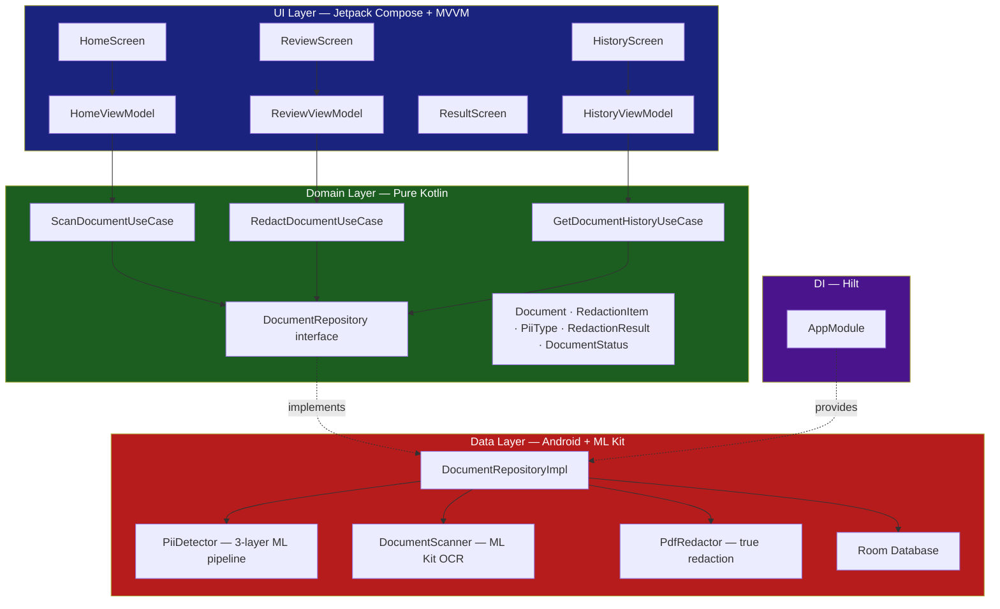
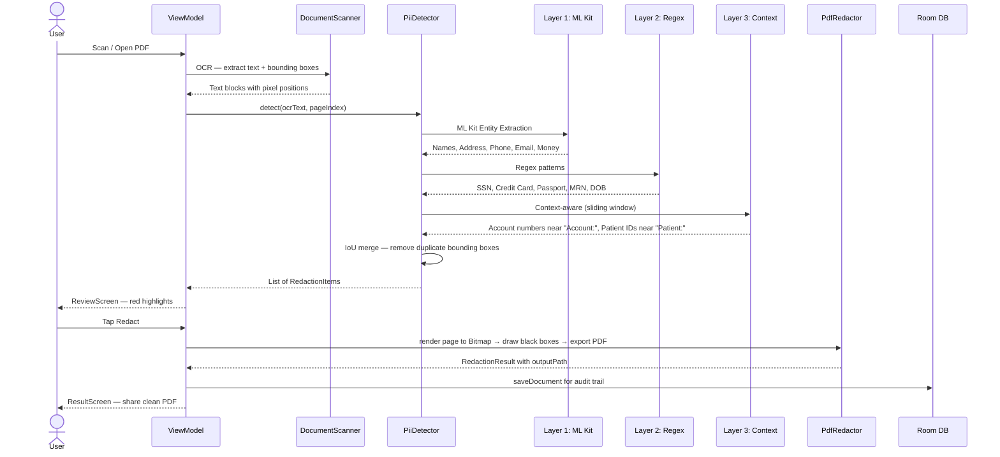

# 🔒 EnterpriseDocumentRedactor

An AI-powered Android app that automatically detects and redacts Personally 
Identifiable Information (PII) from documents — **100% on-device, zero network 
calls, zero data exposure**.


> 📱 Portfolio Project by **Lakshmana Reddy** | Android Tech Lead | 12 years experience  
> 📍 Pleasanton, CA | [GitHub](https://github.com/lakshmanreddymv-bot)

---

## ✨ Features

- **100% On-Device AI** — ML Kit Entity Extraction + OCR runs entirely offline. No internet permission in the manifest.
- **3-Layer PII Detection** — ML Kit → Regex → Context-aware analysis. Each layer catches what the previous misses.
- **True PDF Redaction** — Pages rendered to Bitmap, black boxes drawn over PII bounding boxes, re-exported as image-based PDF. Copy-paste reveals nothing.
- **11 PII Types** — Names, SSN, Credit Cards, Passports, Email, Phone, Address, DOB, Medical IDs, Financial accounts, Custom
- **User Review & Toggle** — Red highlight overlay on document. Tap any item to keep or redact individually.
- **Audit Trail** — Every redaction logged to Room database with timestamp, filename, and item count.
- **Enterprise Security** — FLAG_SECURE on sensitive screens, StrictMode verifies zero network calls, R8 obfuscation enabled in release.
- **Works in Secure Zones** — Hospitals, courtrooms, government buildings where phones cannot access the internet.

---

## 📸 Screenshots

| Home Screen | Review Screen | Result Screen | History Screen |
|---|---|---|---|
| Scan + file picker | PII highlighted red | Redaction stats | Audit trail |

---

## 🏗️ Architecture

### Clean Architecture — 3 Strict Layers
```
UI Layer          →  knows only Domain (ViewModels + Use Cases)
Domain Layer      →  knows nothing (pure Kotlin, zero Android imports)
Data Layer        →  knows only Domain (implements interfaces)
```



---

### 🤖 3-Layer PII Detection Pipeline



---

### 📂 Project Structure

```
EnterpriseDocumentRedactor/
├── domain/                              ← Pure Kotlin, zero Android imports
│   ├── model/
│   │   ├── Document.kt                  # id, fileName, pageCount, status
│   │   ├── RedactionItem.kt             # text, piiType, boundingBox, isSelected, confidence
│   │   ├── PiiType.kt                   # 11 PII types with emoji + description
│   │   ├── RedactionResult.kt           # outputPath, redactedByType, processingTimeMs
│   │   └── DocumentStatus.kt           # sealed: Idle│Scanning│Detecting│Redacting│Complete│Error
│   ├── repository/
│   │   └── DocumentRepository.kt        # Interface — scanDocument(), redactDocument(), history
│   └── usecase/
│       ├── ScanDocumentUseCase.kt
│       ├── RedactDocumentUseCase.kt
│       └── GetDocumentHistoryUseCase.kt
│
├── data/                               ← Android + ML Kit implementations
│   ├── ml/
│   │   ├── PiiDetector.kt              # 3-layer detection + IoU merge
│   │   ├── DocumentScanner.kt          # ML Kit OCR — image + PDF support
│   │   └── ModelDownloadHelper.kt      # ML Kit model download state
│   ├── pdf/
│   │   └── PdfRedactor.kt              # True redaction — renders to Bitmap, removes text layer
│   ├── local/
│   │   ├── DocumentDatabase.kt         # Room database
│   │   ├── DocumentDao.kt              # insert, getAll, Flow<List>
│   │   └── DocumentEntity.kt           # Room entity
│   └── repository/
│       └── DocumentRepositoryImpl.kt   # Coordinates ML Kit + Room + PdfRedactor
│
├── di/
│   └── AppModule.kt                    # Hilt: @Singleton PiiDetector, DocumentScanner, Room
│
├── ui/
│   ├── home/
│   │   ├── HomeScreen.kt               # Camera scan + file picker entry points
│   │   └── HomeViewModel.kt
│   ├── review/
│   │   ├── ReviewScreen.kt             # PII highlights + toggle + category chips
│   │   ├── ReviewViewModel.kt
│   │   └── RedactionUiState.kt
│   ├── result/
│   │   └── ResultScreen.kt             # Stats + share redacted PDF
│   ├── history/
│   │   ├── HistoryScreen.kt            # Audit trail — all past redactions
│   │   └── HistoryViewModel.kt
│   └── components/
│       ├── PiiHighlightOverlay.kt      # Canvas — red/gray boxes, tappable
│       ├── CategorySummaryChip.kt      # Emoji + PII type + count chip
│       └── RedactionSummaryCard.kt     # Final stats card
│
├── EnterpriseDocumentRedactorApp.kt    # @HiltAndroidApp + eager ML Kit init
└── MainActivity.kt                     # NavHost — home, review, result, history
```

---

### 🔄 Unidirectional Data Flow (UDF)


**Pattern:** Clean Architecture + MVVM + Unidirectional Data Flow. Screens are pure functions of their state — zero business logic in composables.

---

## 🛠️ Tech Stack

| Layer | Technology |
|---|---|
| Language | Kotlin |
| UI | Jetpack Compose + Material3 |
| Architecture | Clean Architecture + MVVM + UDF |
| DI | Hilt 2.59.1 |
| Camera | ML Kit Document Scanner 16.0.0-beta4 |
| OCR | ML Kit Text Recognition 16.0.0 |
| PII Detection | ML Kit Entity Extraction 16.0.0-beta5 |
| PDF Redaction | Android PdfRenderer + PdfDocument API |
| Database | Room 2.7.1 |
| Image Loading | Coil 2.7.0 |
| Navigation | Navigation Compose 2.8.9 |
| Async | Coroutines + StateFlow |
| Build | AGP 9.x, Kotlin 2.2.10, KSP 2.2.10-2.0.2, compileSdk 36 |

---

## ⚙️ Setup

### Prerequisites

- Android Studio Hedgehog or newer
- Android device/emulator with Google Play Services (API 26+)
- **No API keys required** — 100% on-device ML Kit

### 1. Clone the repository

```bash
git clone https://github.com/lakshmanreddymv-bot/EnterpriseDocumentRedactor.git
cd EnterpriseDocumentRedactor
```

### 2. Build & Run

```bash
./gradlew assembleDebug
```

Or open in Android Studio → Run ▶️

> **Important:** Use a Google Play emulator (not plain AOSP) so ML Kit Entity Extraction model can download on first launch. After the first run, the app works fully offline.

---

## 📋 Permissions Required

```xml
<uses-permission android:name="android.permission.CAMERA" />
<uses-permission android:name="android.permission.READ_EXTERNAL_STORAGE"
    android:maxSdkVersion="32" />
<uses-permission android:name="android.permission.READ_MEDIA_IMAGES"
    android:minSdkVersion="33" />
<!-- NO INTERNET PERMISSION — by design -->
```

**Zero internet permission** — this is the core enterprise selling point. StrictMode in debug builds crashes the app if any network call is accidentally introduced.

---

## 🔒 Security Architecture

| Feature | Implementation |
|---|---|
| Zero network | No INTERNET permission in manifest |
| Network verification | StrictMode.ThreadPolicy in debug — crashes on any network call |
| Screen protection | FLAG_SECURE on ReviewScreen + ResultScreen — no screenshots or screen recording |
| Release obfuscation | R8 minification enabled — PII detection logic not readable via jadx |
| No PII logging | Only counts logged, never actual text content |
| No cloud backup | allowBackup=false in manifest |

---

## 🧪 PII Detection — 11 Types Across 3 Layers

| Layer | Method | PII Types Detected |
|---|---|---|
| Layer 1 | ML Kit Entity Extraction | 👤 Person Name, 📍 Address, 📞 Phone, 📧 Email, 💰 Financial |
| Layer 2 | Precompiled Regex | 🔒 SSN, 💳 Credit Card, 🛂 Passport, 🏥 Medical Record Number, 📅 Date of Birth |
| Layer 3 | Context-aware (60-char window) | 💰 Account numbers near "Account:", 🏥 Patient IDs near "Patient:" |

**Overlap resolution:** Intersection-over-Union (IoU > 0.3) merges duplicate detections across layers. Highest-confidence detection wins.

**Graceful degradation:** If ML Kit model is unavailable (no Play Services), Layer 2 + Layer 3 still run. The app never shows a blank result.

---

## 📱 Real-World Use Cases

### Use Case 1: Legal Firm — Discovery Document Sharing
```
Document: 20-page contract with client details
Detected: John Smith (PERSON), 123-45-6789 (SSN), john@firm.com (EMAIL),
          Account: 9876543210 (FINANCIAL), 415-555-0192 (PHONE)
Redacted: 5 items → 5 black boxes applied
Result:   Clean PDF shared with opposing counsel — GDPR compliant
```

### Use Case 2: Hospital — Patient Record De-identification
```
Document: Patient intake form
Detected: Jane Doe (PERSON), 04/15/1982 (DOB), MRN-789012 (MEDICAL),
          Blue Shield Policy 445566 (FINANCIAL), jane@gmail.com (EMAIL)
Redacted: 5 items → all 5 HIPAA identifiers removed
Result:   Anonymous record sent to research team — HIPAA Safe Harbor compliant
```

### Use Case 3: Driving Licence — Personal Privacy
```
Document: Driving licence scan
Detected: Full name (PERSON), Date of birth (DOB),
          Home address (ADDRESS), Licence number (CUSTOM)
Redacted: 4 items blacked out
Result:   Safe to email to insurance company — only photo and expiry visible
```

### Use Case 4: Bank — Audit Report Preparation
```
Document: Customer loan application
Detected: 4111-1111-1111-1111 (CREDIT_CARD), 987-65-4320 (SSN),
          Account: 00123456789 (FINANCIAL)
Redacted: 3 items → PCI-DSS compliant version
Result:   Safe to share with external auditor
```

---

## 🐛 Issues Faced & How We Solved Them

### Issue 1: ML Kit Model Download Fails — "Something went wrong"

**Problem:** First launch shows "Downloading..." → "Something went wrong. Try again later."  
**Root Cause:** Plain AOSP emulator has no Google Play Services. ML Kit Entity Extraction requires Play Services for model download.  
**Fix:** Switch to Google Play emulator in AVD Manager. Added `ModelDownloadHelper` with download progress StateFlow. Added banner in HomeScreen: "ML Kit downloading — using regex mode". Regex + context layers still run during download.

---

### Issue 2: Bitmap Memory Leak — OOM on Multi-Page PDFs

**Problem:** 10-page PDF scan caused OutOfMemoryError on real devices. Each page bitmap (~7.3MB) was never recycled.  
**Root Cause:** `DocumentRepositoryImpl` only used `page.ocrText` and silently dropped `page.bitmap`. Native bitmap memory is not GC'd.  
**Fix:** Added `.also { it.bitmap?.recycle() }` after each page's OCR. Added `onCleared()` in `ReviewViewModel` to recycle the last page bitmap.

```kotlin
return pages.flatMap { page ->
    piiDetector.detect(page.ocrText, page.pageIndex).also { page.bitmap?.recycle() }
}
```

---

### Issue 3: PdfDocument Native Leak on Exception

**Problem:** Any exception during redaction left the native PDF context open permanently.  
**Root Cause:** `pdfDoc.close()` was only called on the success path.  
**Fix:** Wrapped entire `PdfDocument` usage in try-finally.

```kotlin
val pdfDoc = PdfDocument()
try {
    // ... render + draw + write
} finally {
    pdfDoc.close()
}
```

---

### Issue 4: CancellationException Swallowed — Coroutines Broken

**Problem:** User exits scan screen mid-scan — ML Kit keeps running in background forever.  
**Root Cause:** `catch (e: Exception)` swallows `CancellationException` which is a subclass of Exception. Cooperative coroutine cancellation breaks.  
**Fix:** Rethrow `CancellationException` before any other handling.

```kotlin
} catch (e: Exception) {
    if (e is CancellationException) throw e
    Log.w(TAG, "ML Kit annotation failed: ${e.javaClass.simpleName}")
    return emptyList()
}
```

---

### Issue 5: Unsafe Activity Cast — ClassCastException in Compose

**Problem:** `context as Activity` crashes in Compose previews and wrapped contexts. Flagged by Android Lint.  
**Fix:** Added `findActivity()` extension that walks the ContextWrapper chain safely.

```kotlin
fun Context.findActivity(): Activity? {
    var ctx = this
    while (ctx is ContextWrapper) {
        if (ctx is Activity) return ctx
        ctx = ctx.baseContext
    }
    return null
}
```

---

### Issue 6: Gradle Build Failures — Version Conflicts

**Problem:** Multiple dependency version conflicts on AGP 9.x + Kotlin 2.2.10.  
**Fixes applied:**

| Issue | Fix |
|---|---|
| KSP version mismatch | 2.2.10-1.0.29 → 2.2.10-2.0.2 |
| Hilt "BaseExtension not found" on AGP 9.x | 2.52 → 2.59.1 |
| Room "unexpected jvm signature" on suspend funs | 2.6.1 → 2.7.1 |
| kotlin-android plugin conflict in Kotlin 2.x | Removed — use kotlin.compose only |
| activity:1.13.0 requires API 36 | compileSdk 26 → 36 |
| KSP + AGP 9.x source set issue | android.disallowKotlinSourceSets=false |

---

### Issue 7: isMinifyEnabled = false in Release

**Problem:** Entire PII detection logic, all regex patterns, and ML Kit integration readable in APK via jadx. Unacceptable for enterprise security product.  
**Fix:** Enabled R8 + isShrinkResources in release. Added ML Kit, Hilt, Room, and Coroutines ProGuard rules to proguard-rules.pro.

---

## 🗺️ Roadmap

- [ ] Multi-language PII detection (Spanish, French, German)
- [ ] Batch document processing — multiple files at once
- [ ] Custom PII rules — user-defined patterns
- [ ] Password-protected PDF support
- [ ] Export redaction report as compliance certificate
- [ ] Biometric authentication before viewing History

---

## 🤝 Part of AI Android Portfolio

This is **Project 3** in a series of AI-powered Android apps:

| # | Project | Status | Description |
|---|---|---|---|
| 1 | [MySampleApplication-AI](https://github.com/lakshmanreddymv-bot/MySampleApplication-AI) | ✅ Complete | AI Natural Language Search — Gemini API |
| 2 | [FakeProductDetector](https://github.com/lakshmanreddymv-bot/FakeProductDetector) | ✅ Complete | Dual-AI product authentication — Gemini + Claude |
| 3 | **EnterpriseDocumentRedactor** | ✅ Complete | On-device PII redaction — 100% offline ML Kit |
| 4 | Coming Soon | 🔨 Planning | ... |

---

## 📄 License

```
MIT License
Copyright (c) 2026 Lakshmana Reddy

Permission is hereby granted, free of charge, to any person obtaining a copy
of this software and associated documentation files (the "Software"), to deal
in the Software without restriction, including without limitation the rights
to use, copy, modify, merge, publish, distribute, sublicense, and/or sell
copies of the Software, and to permit persons to whom the Software is
furnished to do so, subject to the following conditions:

The above copyright notice and this permission notice shall be included in all
copies or substantial portions of the Software.

THE SOFTWARE IS PROVIDED "AS IS", WITHOUT WARRANTY OF ANY KIND.
```

---

## 👨‍💻 Author

**Lakshmana Reddy**  
Android Tech Lead | 12 years experience  
📍 Pleasanton, CA  
🔗 [GitHub](https://github.com/lakshmanreddymv-bot)

---

*Built with ❤️ and on-device AI — because some data should never leave your device*
