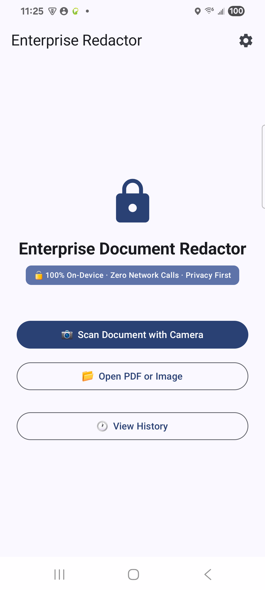
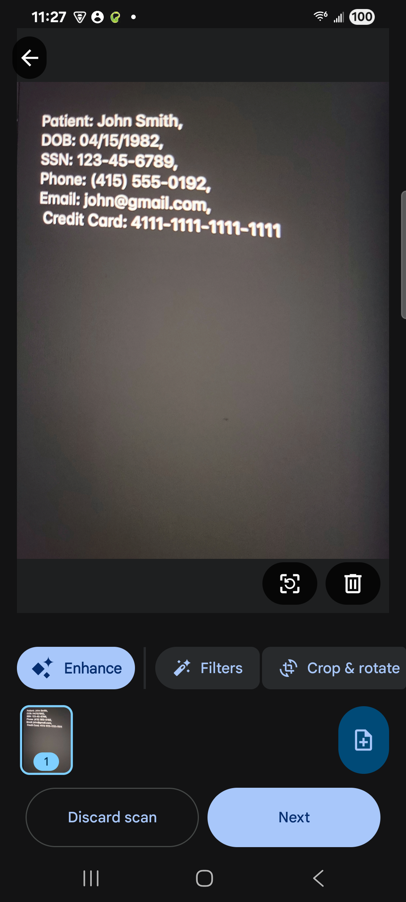
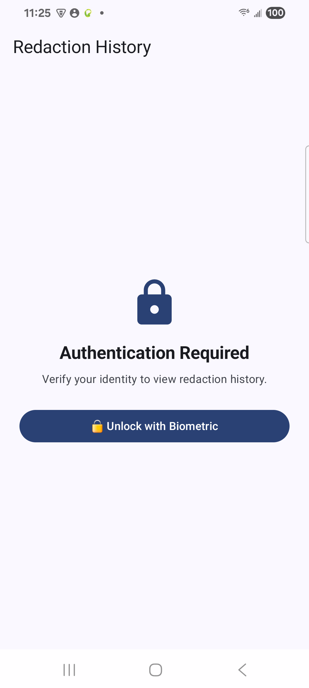
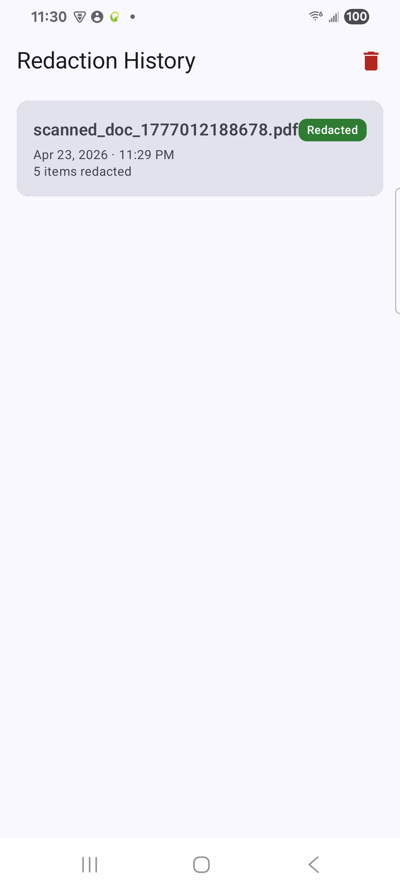
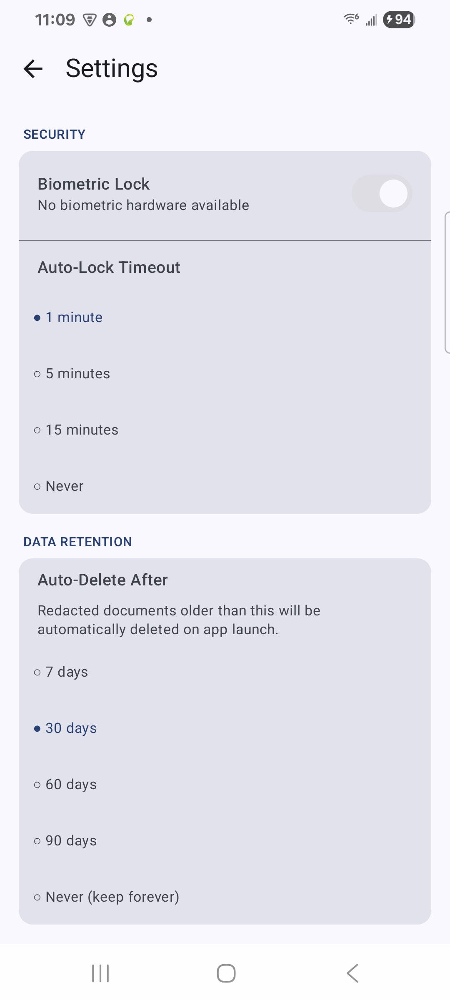
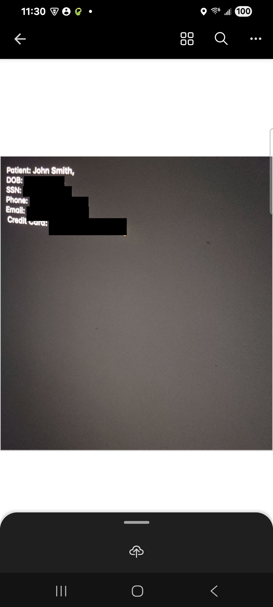
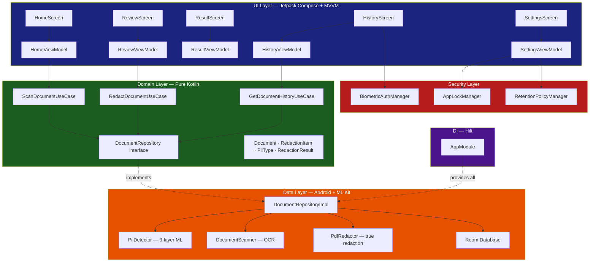
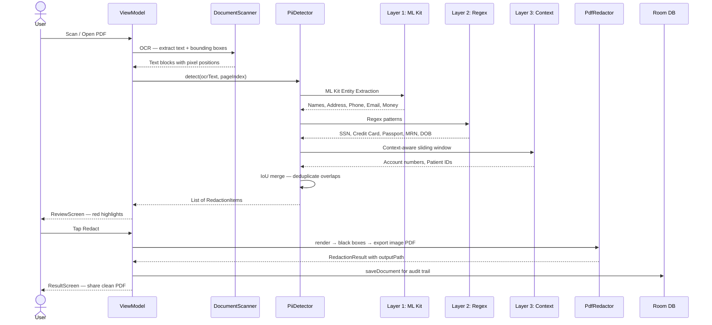
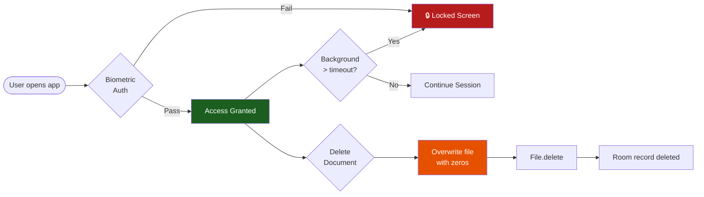

# 🔒 EnterpriseDocumentRedactor

An AI-powered Android app that automatically detects and redacts Personally Identifiable Information (PII) from documents — **100% on-device, zero network calls, zero data exposure**.

> 📱 Portfolio Project by **Lakshmana Reddy** | Android Tech Lead | 12 years experience
> 📍 Pleasanton, CA | [GitHub](https://github.com/lakshmanreddymv-bot)


---

## 📸 Screenshots

<div align="center">
<table>
  <tr>
    <td align="center"><b>Home Screen</b></td>
    <td align="center"><b>Camera Scan</b></td>
    <td align="center"><b>Biometric Auth</b></td>
  </tr>
  <tr>
    <td></td>
    <td></td>
    <td></td>
  </tr>
  <tr>
    <td align="center"><b>History Screen</b></td>
    <td align="center"><b>Settings Screen</b></td>
    <td align="center"><b>Redacted PDF</b></td>
  </tr>
  <tr>
    <td></td>
    <td></td>
    <td></td>
  </tr>
</table>
</div>

---

## ✨ Features

### 🤖 AI & Detection
- **100% On-Device AI** — ML Kit Entity Extraction + OCR runs entirely offline. No internet permission in the manifest.
- **3-Layer PII Detection** — ML Kit → Regex → Context-aware analysis. Each layer catches what the previous misses.
- **11 PII Types** — Names, SSN, Credit Cards, Passports, Email, Phone, Address, DOB, Medical IDs, Financial accounts, Custom
- **Graceful Degradation** — If ML Kit model unavailable, Regex + Context layers still run. Never shows blank results.

### 📄 Document Processing
- **True PDF Redaction** — Pages rendered to Bitmap, black boxes drawn over PII bounding boxes, re-exported as image-based PDF. Copy-paste reveals nothing underneath.
- **Camera Scan** — ML Kit Document Scanner for physical documents
- **File Picker** — Open existing PDFs or images from device storage
- **User Review & Toggle** — Red highlight overlay on document. Tap any item to keep or redact individually.
- **OOM Protection** — Large images downsampled safely before OCR using `inSampleSize` guard.

### 🔒 Enterprise Security
- **Biometric Authentication** — Fingerprint/Face ID gates access to document history. Lock screen shown on History entry.
- **Auto-Lock Timeout** — App locks after 1/5/15 minutes in background. Configurable in Settings. `-1` = Never.
- **Secure File Deletion** — Files overwritten with zeros before deletion. Prevents forensic recovery. HIPAA compliant.
- **Zero Network Calls** — No INTERNET permission in manifest. StrictMode crashes debug build if network call sneaks in.
- **FLAG\_SECURE** — ReviewScreen + ResultScreen cannot be screenshotted or screen-recorded.
- **R8 Obfuscation** — PII detection logic not readable via jadx in release builds.
- **No PII Logging** — Only counts logged, never actual content.
- **No Cloud Backup** — `allowBackup=false` in manifest.

### 📋 History & Audit Trail
- **Complete Audit Log** — Every redaction logged to Room DB with filename, timestamp, and item count.
- **Swipe to Delete** — Swipe left on any history item to delete with confirmation dialog.
- **Delete All** — Clear entire history with one tap + confirmation.
- **True Deletion** — Removes both Room record AND PDF file from device storage.
- **Biometric Gate** — History screen requires biometric auth before showing documents.

### ⚙️ Settings & Compliance
- **Auto-Delete Policy** — Documents auto-deleted after 7/30/60/90 days. GDPR storage limitation compliant.
- **Configurable Auto-Lock** — 1 min / 5 min / 15 min / Never. Persisted to SharedPreferences.
- **Retention Policy** — Enforced on every app launch via `RetentionPolicyManager`.
- **Cache Cleanup** — Temp files older than 24h auto-deleted on startup.

### 🔄 Works Offline
- Hospitals, courtrooms, secure government facilities — no WiFi required
- All processing stays on-device forever after first ML Kit model download

---

## 🏗️ Architecture

### Clean Architecture — 3 Strict Layers

```
UI Layer     →  knows only Domain (ViewModels + Use Cases)
Domain Layer →  knows nothing (pure Kotlin, zero Android imports)
Data Layer   →  knows only Domain (implements interfaces)
```



---

### 🤖 3-Layer PII Detection Pipeline



---

### 🔒 Security Architecture



---

### 📂 Project Structure

```
EnterpriseDocumentRedactor/
├── domain/                              ← Pure Kotlin, zero Android imports
│   ├── model/
│   │   ├── Document.kt
│   │   ├── RedactionItem.kt
│   │   ├── PiiType.kt                   # 11 PII types
│   │   ├── RedactionResult.kt
│   │   └── DocumentStatus.kt           # sealed class
│   ├── repository/
│   │   └── DocumentRepository.kt        # Interface
│   └── usecase/
│       ├── ScanDocumentUseCase.kt
│       ├── RedactDocumentUseCase.kt
│       └── GetDocumentHistoryUseCase.kt
│
├── data/
│   ├── ml/
│   │   ├── PiiDetector.kt              # 3-layer detection + IoU merge
│   │   ├── DocumentScanner.kt          # ML Kit OCR + OOM guard
│   │   └── ModelDownloadHelper.kt      # Download state + 30s timeout
│   ├── pdf/
│   │   └── PdfRedactor.kt              # True redaction — removes text layer
│   ├── local/
│   │   ├── DocumentDatabase.kt
│   │   ├── DocumentDao.kt
│   │   └── DocumentEntity.kt
│   └── repository/
│       └── DocumentRepositoryImpl.kt   # secureDelete() included
│
├── security/                           ← Enterprise security layer
│   ├── BiometricAuthManager.kt         # Fingerprint/Face ID + status enum
│   ├── AppLockManager.kt               # Auto-lock + configurable timeout
│   └── RetentionPolicyManager.kt       # Auto-delete old documents
│
├── di/
│   └── AppModule.kt
│
├── ui/
│   ├── home/
│   │   ├── HomeScreen.kt               # Camera scan + file picker + settings icon
│   │   └── HomeViewModel.kt
│   ├── review/
│   │   ├── ReviewScreen.kt             # PII highlights + toggle + category chips
│   │   ├── ReviewViewModel.kt
│   │   └── RedactionUiState.kt
│   ├── result/
│   │   ├── ResultScreen.kt             # Stats + share redacted PDF
│   │   └── ResultViewModel.kt          # Extracted to own file
│   ├── history/
│   │   ├── HistoryScreen.kt            # Swipe-to-delete + biometric gate
│   │   └── HistoryViewModel.kt
│   ├── settings/
│   │   ├── SettingsScreen.kt           # Security + retention UI
│   │   └── SettingsViewModel.kt        # Persists to SharedPreferences
│   └── components/
│       ├── PiiHighlightOverlay.kt
│       ├── CategorySummaryChip.kt
│       └── RedactionSummaryCard.kt
│
├── EnterpriseDocumentRedactorApp.kt    # Lifecycle observer + retention + cache cleanup
└── MainActivity.kt                     # Lock screen + NavHost (5 routes)
```

---

## 🛠️ Tech Stack

| Layer | Technology |
|---|---|
| Language | Kotlin 2.2.10 |
| UI | Jetpack Compose + Material3 |
| Architecture | Clean Architecture + MVVM + UDF |
| DI | Hilt 2.59.1 |
| Camera | ML Kit Document Scanner 16.0.0-beta4 |
| OCR | ML Kit Text Recognition 16.0.0 |
| PII Detection | ML Kit Entity Extraction 16.0.0-beta5 |
| PDF Redaction | Android PdfRenderer + PdfDocument API |
| Database | Room 2.7.1 |
| Biometric | AndroidX Biometric 1.1.0 |
| Image Loading | Coil 2.7.0 |
| Navigation | Navigation Compose 2.8.9 |
| Async | Coroutines + StateFlow + SharedFlow |
| Build | AGP 9.x, KSP 2.2.10-2.0.2, compileSdk 36 |

---

## ⚙️ Setup

### Prerequisites

- Android Studio Hedgehog or newer
- Android device/emulator with Google Play Services (API 26+)
- **No API keys required** — 100% on-device ML Kit

### Clone & Run

```bash
git clone https://github.com/lakshmanreddymv-bot/EnterpriseDocumentRedactor.git
cd EnterpriseDocumentRedactor
./gradlew assembleDebug
```

> **Important:** Use a Google Play emulator (not plain AOSP). After first launch ML Kit model downloads once — then works fully offline forever.

---

## 📋 Permissions

```xml
<uses-permission android:name="android.permission.CAMERA" />
<uses-permission android:name="android.permission.USE_BIOMETRIC" />
<uses-permission android:name="android.permission.USE_FINGERPRINT" />
<uses-permission android:name="android.permission.READ_EXTERNAL_STORAGE"
    android:maxSdkVersion="32" />
<uses-permission android:name="android.permission.READ_MEDIA_IMAGES" />
<!-- NO INTERNET PERMISSION — by design -->
```

---

## 🔒 Security Architecture

| Feature | Implementation | Standard |
|---|---|---|
| Zero network | No INTERNET permission in manifest | HIPAA, GDPR |
| Network verification | StrictMode crashes on any network call in debug | Dev safety |
| Screen protection | FLAG_SECURE on Review + Result screens | HIPAA |
| Biometric lock | AndroidX BiometricPrompt — BIOMETRIC_STRONG | HIPAA access control |
| Auto-lock timeout | Configurable: 1/5/15 min / Never, persisted to prefs | HIPAA |
| Secure deletion | Overwrite with zeros (64KB chunks) → File.delete() | HIPAA forensics |
| DB backup disabled | allowBackup=false in manifest | GDPR |
| Release obfuscation | R8 minification enabled | Security |
| No PII logging | Counts only, never text content | HIPAA |
| Data retention | Auto-delete after 7/30/60/90 days on launch | GDPR Art.5 |
| Audit trail | Timestamped Room DB log per redaction | HIPAA audit |

---

## 🧪 PII Detection — 11 Types Across 3 Layers

| Layer | Method | Detects |
|---|---|---|
| Layer 1 | ML Kit Entity Extraction | 👤 Name, 📍 Address, 📞 Phone, 📧 Email, 💰 Financial |
| Layer 2 | Precompiled Regex | 🔒 SSN, 💳 Credit Card, 🛂 Passport, 🏥 MRN, 📅 DOB |
| Layer 3 | Context-aware (60-char window) | 💰 Account numbers, 🏥 Patient IDs |

**Overlap resolution:** IoU > 0.3 merges duplicates. Highest confidence wins.

**Graceful degradation:** Layers 2+3 always run — even without Play Services.

---

## 📱 Real-World Use Cases

### Legal Firm — Discovery Documents

```
Input:  20-page contract
Found:  Name, SSN, Email, Account number, Phone
Result: Clean PDF → opposing counsel — GDPR compliant
```

### Hospital — Patient De-identification

```
Input:  Patient intake form
Found:  Name, DOB, MRN, Insurance policy, Email
Result: Anonymous record → research team — HIPAA Safe Harbor
```

### Personal — Driving Licence

```
Input:  Driving licence scan
Found:  Full name, DOB, Address, Licence number
Result: Safe to email to insurance — only photo visible
```

### Bank — Audit Preparation

```
Input:  Loan application
Found:  Credit card, SSN, Account number
Result: PCI-DSS compliant version → auditor
```

---

## 🐛 Issues Faced & Fixed

| # | Problem | Root Cause | Fix |
|---|---|---|---|
| 1 | ML Kit "Something went wrong" | Plain AOSP emulator, no Play Services | Switch to Google Play emulator + ModelDownloadHelper fallback |
| 2 | OOM on multi-page PDF | 10 pages × 7.3MB bitmaps never recycled | bitmap.recycle() after OCR + onCleared() in ReviewViewModel |
| 3 | PdfDocument native leak | close() only on success path | try-finally around pdfDoc.close() |
| 4 | Coroutine cancellation broken | CancellationException swallowed in catch(Exception) | Rethrow CancellationException first |
| 5 | ClassCastException in Compose | context as Activity unsafe cast | findActivity() extension walking ContextWrapper chain |
| 6 | Gradle version conflicts | AGP 9.x + Kotlin 2.2.10 incompatibilities | KSP 2.0.2, Hilt 2.59.1, Room 2.7.1, compileSdk 36 |
| 7 | R8 disabled in release | isMinifyEnabled = false | Enabled R8 + ProGuard rules for ML Kit/Hilt/Room |
| 8 | Settings not persisting across launches | No SharedPreferences — in-memory only | SettingsViewModel with full SharedPreferences persistence |
| 9 | Large image OOM in scanImage() | No inSampleSize on BitmapFactory | calculateInSampleSize() guard + RGB_565 config before decode |
| 10 | Encrypted PDF cryptic crash | SecurityException not caught specifically | Catch SecurityException → "This PDF is password-protected" message |

---

## 🗺️ Roadmap

- [ ] SQLCipher — AES-256 Room database encryption
- [ ] Tamper-proof audit log with SHA-256 hashing
- [ ] Multi-language PII detection (Spanish, French, German)
- [ ] Batch document processing
- [ ] Password-protected PDF support
- [ ] Export compliance certificate PDF
- [ ] Custom PII rules — user-defined regex patterns

---

## 🤝 AI Android Portfolio

| # | Project | Status | Description |
|---|---|---|---|
| 1 | [MySampleApplication-AI](https://github.com/lakshmanreddymv-bot/MySampleApplication-AI) | ✅ Complete | AI Natural Language Search — Gemini API |
| 2 | [FakeProductDetector](https://github.com/lakshmanreddymv-bot/FakeProductDetector) | ✅ Complete | Dual-AI authentication — Gemini + Claude |
| 3 | **EnterpriseDocumentRedactor** | ✅ Complete | On-device PII redaction — 100% offline |
| 4 | Coming Soon | 🔨 Planning | — |

---

## 📄 License

MIT License — Copyright (c) 2026 Lakshmana Reddy

---

## 👨‍💻 Author

**Lakshmana Reddy**
Android Tech Lead | 12 years experience
📍 Pleasanton, CA
🔗 [GitHub](https://github.com/lakshmanreddymv-bot)

---

*Built with ❤️ and on-device AI — because some data should never leave your device*
